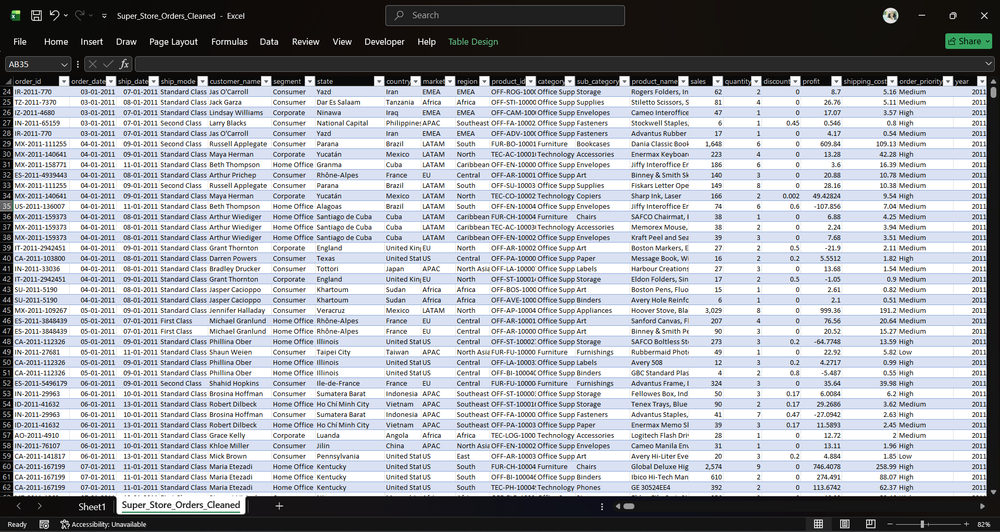
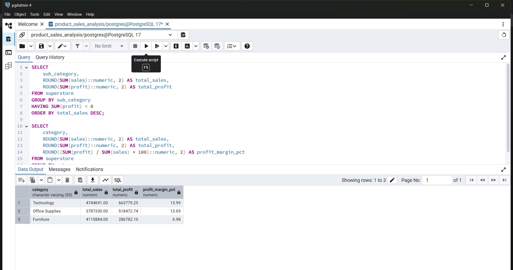
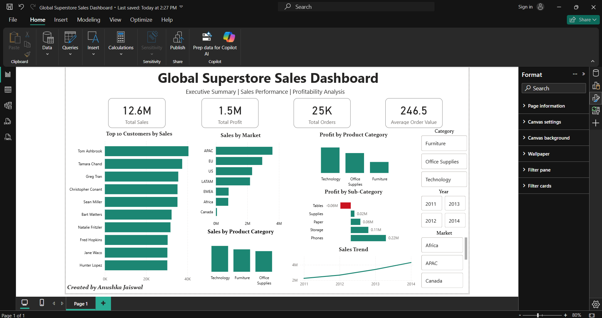

#  Product Sales Analysis — Global Superstore

A complete end-to-end Sales Analysis project using **Excel**, 
**PostgreSQL**, and **Power BI** to analyze a global retail 
dataset and deliver actionable business insights.

---

## 📌 Project Objective

To perform a structured product sales analysis on the Global 
Superstore dataset, identifying revenue trends, category-level 
profitability gaps, regional performance, customer behaviour, 
and loss-making segments across 51,290 rows of retail data.

---

## 🛠️ Tools & Technologies

- Microsoft Excel — Data Cleaning & Exploration
- PostgreSQL — Business Analysis & SQL Querying
- Power BI — Interactive Dashboard & Data Visualisation
- Git & GitHub — Version Control & Project Documentation

---

## 🔧 Project Workflow

**Step 1 — Data Collection & Cleaning (Excel)**
Downloaded the Global Superstore dataset from Kaggle. Performed 
data cleaning in Microsoft Excel — handled missing values, removed 
duplicates, standardised column formats, and ensured data 
integrity across 51,290 rows and 21 columns before analysis.

**Step 2 — Business Analysis (PostgreSQL)**
Imported the cleaned dataset into PostgreSQL and wrote 18 
structured SQL queries to answer key business questions across 
revenue, profitability, regional performance, customer behaviour, 
discount impact, and year-over-year growth trends.

**Step 3 — Dashboard Development (Power BI)**
Built an interactive Power BI dashboard featuring KPI cards, 
sales trend analysis, category and sub-category profitability, 
market comparisons, and top customer rankings — with dynamic 
slicers for Year, Category, and Market.

---

## 📊 Key Performance Indicators

| Metric | Value |
|--------|-------|
| 💰 Total Sales | $12.6M |
| 📈 Total Profit | $1.47M |
| 🛒 Total Orders | 25K |
| 💵 Average Order Value | $246.50 |

---

## 🔍 Key Business Insights

- **Revenue nearly doubled** from $2.2M in 2011 to $4.3M in 2014, 
with profit growing consistently in parallel, indicating healthy 
and sustainable business growth over four years.

- **Furniture has a profit margin of only 6.98%** — less than half 
of Technology (13.99%) and Office Supplies (13.69%) — despite 
being the second highest revenue generating category, signaling 
inefficiency likely driven by heavy discounting or high shipping 
costs on bulky items.

- **Tables is the only sub-category generating negative profit** 
(-$64K) despite $757K in sales, representing a critical 
loss-making segment requiring immediate pricing or discount 
strategy review.

- **APAC generated the highest overall sales** among all global 
markets, making it the most important region for revenue 
performance.

- **Technology leads on both total sales ($4.7M) and profit margin 
(13.99%)**, making it the strongest performing category across 
all dimensions.

- **Phones was the most profitable sub-category**, followed closely 
by Copiers, together driving the majority of Technology's 
category profit.

---

## 🗂️ Data Preview


## 🔍 SQL Query Preview


## 📷 Dashboard Preview



---

## 🎯 Business Questions Answered

- Which product category generates the highest sales and profit?
- What is the profit margin across categories?
- Which sub-categories are loss-making despite high sales?
- Which market and region drives the most revenue?
- Who are the top 10 customers by sales?
- How have sales and profit trended from 2011 to 2014?
- Does offering higher discounts reduce profitability?
- Which products have the highest sales volume by quantity?

---

## 📁 Repository Structure

```
Product-Sales-Analysis
│
├── 1_Data
│   └── Super_Store_Orders_Cleaned.csv
│
├── 2_SQL
│   ├── 01_data_cleaning.sql
│   └── 02_Business_Analysis.sql
│
├── 3_Dashboard
│   └── Global Superstore Sales Dashboard.pbix
│
├── 4_Images
│   └── Dashboard.png
│
└── README.md
```

## 💼 Skills Demonstrated

Data Cleaning

SQL

Business Analysis

Data Visualization

Power BI

Dashboard Design

KPI Reporting

Profitability Analysis

Data Storytelling

Git & GitHub

---

## 👩‍💻 Author

**Anushka Jaiswal**  

GitHub: [Anushka4568](https://github.com/Anushka4568)

LinkedIn: [Anushka Jaiswal](https://www.linkedin.com/in/anushhhhkkkaaaa/)

---

⭐ If you found this project helpful, feel free to star 
the repository!
